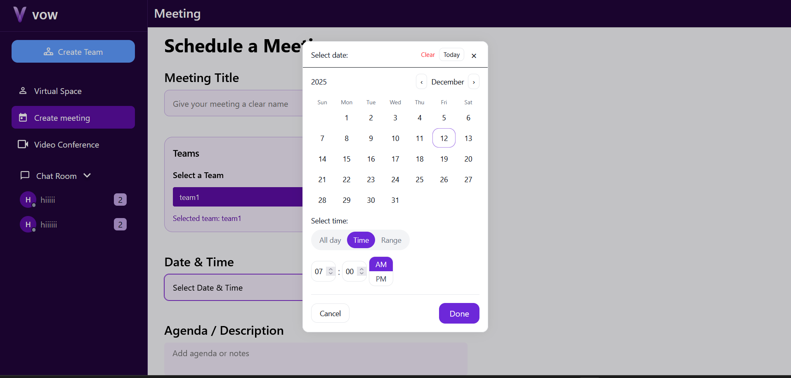
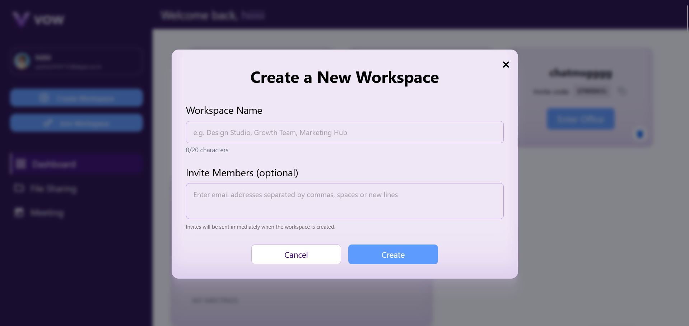
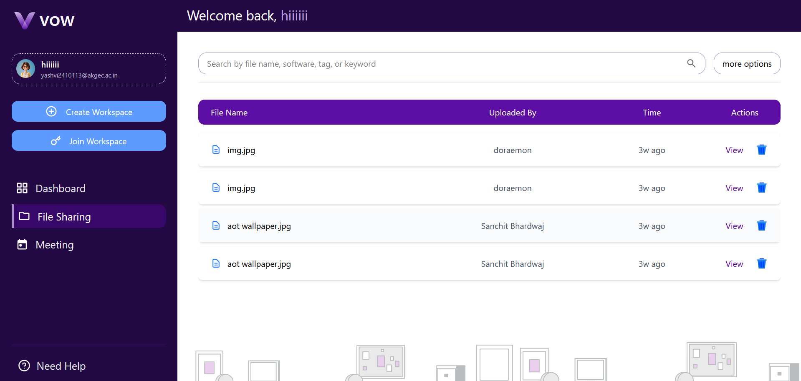
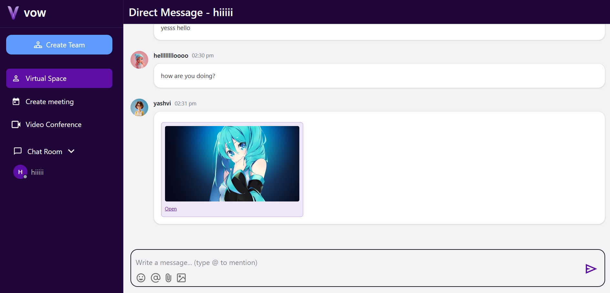

#  VOW – Virtual Organized World  
A next-generation virtual workspace platform that enables distributed teams to **meet, collaborate, and communicate** in real time.  
VOW enhances remote work culture through immersive virtual offices, interactive meeting environments, and seamless collaboration tools.

---
## 🧩 Overview
**VOW (Virtual Organized World)** replicates real-world office interactions within a digital environment.  
With customizable virtual workspaces, real-time communication, collaborative tools, and built-in meeting systems, VOW is designed to elevate distributed teamwork.

---
## 📸 Preview
<table>
  <tr>
    <td></td>
    <td></td>
  </tr>
  <tr>
    <td></td>
    <td></td>
  </tr>
</table>

---

## 📌 Table of Contents
- [Overview](#overview)
- [User Roles](#user-roles)
- [Core Features](#core-features)
- [Future Enhancements](#future-enhancements)
- [Tech Stack](#tech-stack)
- [Architecture Overview](#architecture-overview)
- [Getting Started](#getting-started)
- [Folder Structure](#folder-structure)
- [Contributing](#contributing)
- [License](#license)

---

## 👥 User Roles

### **Manager**
- Create and configure virtual office environments.  
- Manage organization-wide roles and permissions.  
- Customize themes, layouts, and workspace components.  
- Assign team-wide announcements and tasks.

### **Supervisor**
- Lead teams and monitor workspace analytics.  
- Track attendance, engagement, and user activity.  
- Assign individual tasks and coordinate daily operations.

### **Team Member**
- Join virtual rooms and participate in meetings.  
- Communicate via voice, video, and chat.  
- Move freely within the virtual office.  
- Share screens, co-edit documents, and provide feedback.

---

## ⭐ Core Features

### 🔐 Authentication
- Secure email-based login/signup  
- Password reset support  
- Token-based authentication (JWT)  
- Role-based access control  

---

### 🏢 Virtual Office & Collaboration
- **Customizable Workspaces**  
  Build dynamic virtual office layouts with meeting rooms, lounges, and social areas.  

- **Presence Tracking**  
  Real-time visibility into who’s online, away, in a meeting, or available.  

- **WebRTC Spatial Audio & Video**  
  Proximity-based communication for an immersive office experience.  

- **Screen Sharing & Document Collaboration**  
  Present content and co-edit files in live sessions.  

- **Room Navigation**  
  Move between rooms and join teams effortlessly.  

---

### 📅 Meetings & Scheduling
- Workspace-based meeting scheduling  
- Calendar integrations (Google, Outlook)  
- Smart reminders before sessions  
- One-click join via room-based links  

---

### 💬 Messaging System
- Direct, group, and channel-based chat  
- File sharing & attachments  
- Real-time message sync via sockets  

---

## 🔮 Future Enhancements
- **AI Meeting Assistant**  
  Auto-summarization, task extraction, follow-ups.

- **Hybrid Mode**  
  Bridge physical and virtual meeting spaces.

- **Workspace Monetization**  
  Host paid sessions and community events.

- **Gamified Recognition System**  
  Reward active contributors and top performers.

---

## 🛠 Tech Stack

### **Frontend**
- React.js  
- Tailwind CSS / Styled Components (optional UI layers)  

### **Backend**
- Node.js + Express  
- WebRTC for real-time audio & video  
- MongoDB for data storage  
- Socket.IO for live interactions  

---
##  Acknowledgement

We would like to express our sincere appreciation to the technologies and communities that made **VOW – Virtual Organized World** possible:

- **React.js** for providing a powerful, component-driven foundation for building an interactive and scalable user interface.  
- **Tailwind CSS** for enabling rapid, modern, and highly customizable UI design with utility-first styling.  
- **Open-source Community** for the countless libraries, tools, and resources that supported the functionality and performance of this project.

This project stands on the shoulders of these incredible technologies and contributors, and we gratefully acknowledge their impact.

