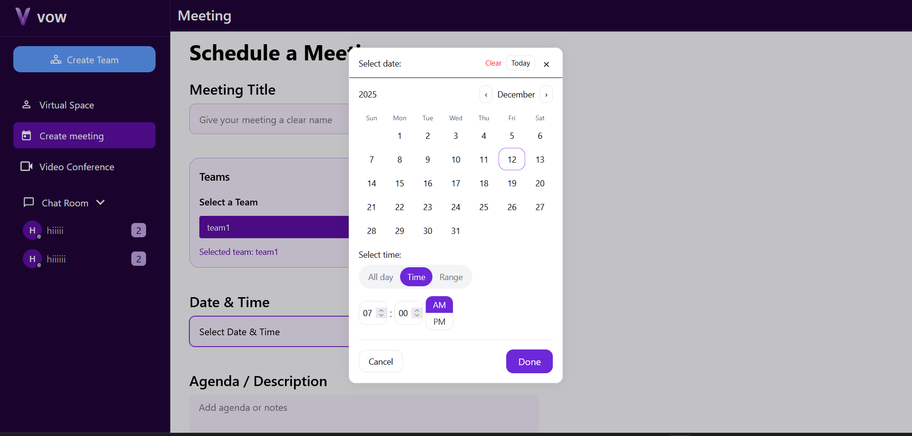
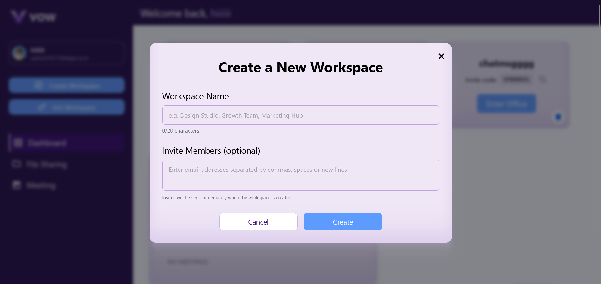
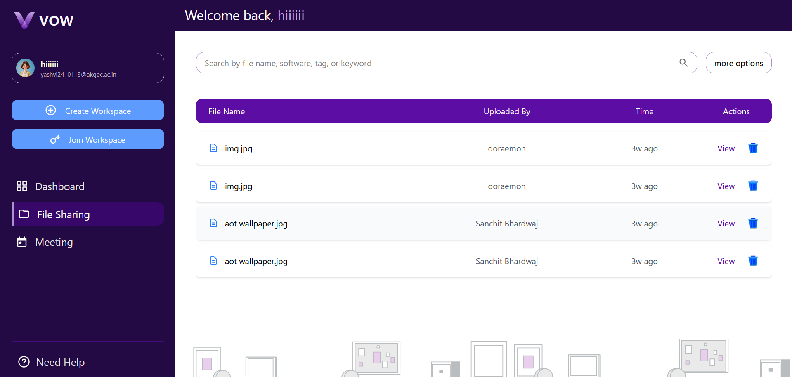
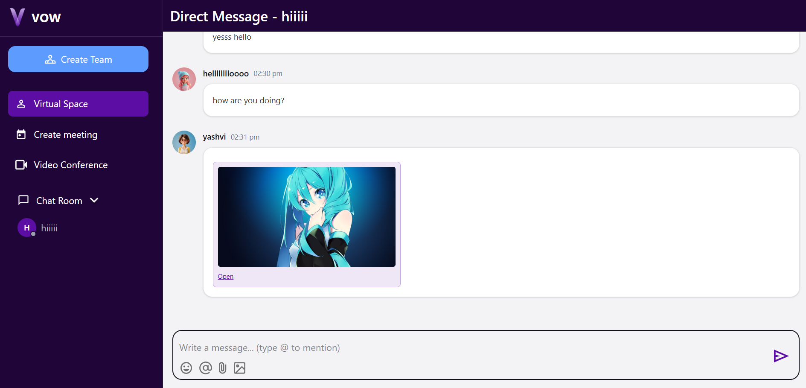
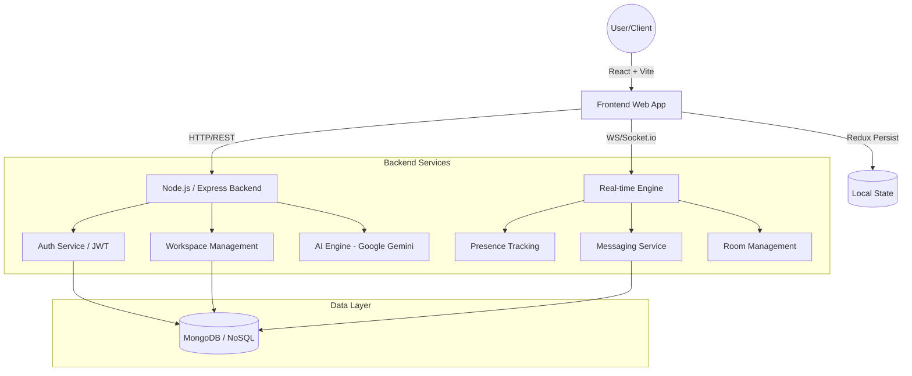

#  VOW – Virtual Organized World  
A next-generation virtual workspace platform that enables distributed teams to **meet, collaborate, and communicate** in real time.  
VOW enhances remote work culture through immersive virtual offices, interactive meeting environments, and seamless collaboration tools.

---

## 🎥 Demo Video
Experience the Virtual Organized World in action:

https://github.com/user-attachments/assets/12c1c38a-7fc0-458b-b54f-c4655f5b9b5e

---

## 🧩 Overview
**VOW (Virtual Organized World)** replicates real-world office interactions within a digital environment.  
With customizable virtual workspaces, real-time communication, collaborative tools, and built-in meeting systems, VOW is designed to elevate distributed teamwork.

---

## 📸 Preview
<table>
  <tr>
    <td></td>
    <td></td>
  </tr>
  <tr>
    <td></td>
    <td></td>
  </tr>
</table>

---

## 📌 Table of Contents
- [Overview](#-overview)
- [Demo Video](#-demo-video)
- [User Roles](#-user-roles)
- [Core Features](#-core-features)
- [System Architecture](#-system-architecture)
- [System Design](#-system-design)
- [Tech Stack](#-tech-stack)
- [Getting Started](#-getting-started)
- [Folder Structure](#-folder-structure)
- [Contributing](#-contributing)
- [License](#-license)

---

## 👥 User Roles

### **Manager**
- Create and configure virtual office environments.  
- Manage organization-wide roles and permissions.  
- Customize themes, layouts, and workspace components.  
- Assign team-wide announcements and tasks.

### **Supervisor**
- Lead teams and monitor workspace analytics.  
- Track attendance, engagement, and user activity.  
- Assign individual tasks and coordinate daily operations.

### **Team Member**
- Join virtual rooms and participate in meetings.  
- Communicate via voice, video, and chat.  
- Move freely within the virtual office.  
- Share screens, co-edit documents, and provide feedback.

---

## ⭐ Core Features

### 🔐 Authentication
- Secure email-based login/signup with OTP verification.
- JWT-based authentication with Refresh Token support.
- Role-based access control (Manager, Supervisor, Team Member).

### 🏢 Virtual Office & Collaboration
- **Customizable Workspaces**: Dynamic layouts with meeting rooms and social areas.
- **Real-time Spatiality**: Proximity-based visibility and movement using pathfinding algorithms.
- **WebRTC Communication**: High-quality audio/video for an immersive experience.
- **Messaging**: Direct & channel-based chat with file sharing and emoji support.

### 📅 Smart Meetings
- Workspace-integrated scheduling for seamless transitions.
- Automatic reminders and calendar syncing.
- AI-powered summaries (powered by Google Gemini).

---

## 🏗 System Architecture

VOW utilizes a high-concurrency architecture to manage real-time interactions across distributed teams.

```mermaid
graph TD
    User((User/Client)) -->|React + Vite| WebApp[Frontend Web App]
    WebApp -->|Redux Persist| LocalState[(Local State)]
    WebApp -->|HTTP/REST| ExpressAPI[Node.js / Express Backend]
    WebApp -->|WS/Socket.io| RealTime[Real-time Engine]
    
    subgraph Backend Services
        ExpressAPI --> Auth[Auth Service / JWT]
        ExpressAPI --> Workspace[Workspace Management]
        ExpressAPI --> Gemini[AI Engine - Google Gemini]
        RealTime --> Presence[Presence Tracking]
        RealTime --> Chat[Messaging Service]
        RealTime --> Rooms[Room Management]
    end
    
    subgraph Data Layer
        Auth --> DB[(MongoDB / NoSQL)]
        Workspace --> DB
        Chat --> DB
    end
```

---

## ⚙ System Design

### 1. Real-Time Sync Engine
The heart of VOW is its Socket.io implementation. It handles:
- **Presence**: Real-time "Who is online" and room occupancy tracking.
- **Broadcast Events**: Immediate delivery of messages and workspace updates.
- **Low Latency**: Optimized for real-time collaboration without lag.

### 2. Immersive Navigation
VOW uses the `pathfinding` library to simulate realistic movements within the virtual office. This allows users to "walk" to desks or meeting rooms, triggering proximity-based interactions.

### 3. AI Copilot (Gemini Integration)
Integrated with **Google Gemini Pro**, VOW provides:
- **Smart Recaps**: Automatically generates summaries of missed conversations or meetings.
- **Contextual Assistance**: Quick answers within the chat interface using `@genai`.

### 4. Modular Frontend Architecture
Built with **React 19**, the frontend is highly modular:
- **Feature-based folders**: `auth`, `dashboard`, `meetings` partitioned for scalability.
- **State Management**: **Redux Toolkit** ensures a single source of truth for complex application states.

---

## 🛠 Tech Stack

### **Frontend**
- **Framework**: React 19 (Vite)
- **State**: Redux Toolkit, Redux Persist
- **Styles**: Tailwind CSS 4.0, Lucide Icons
- **Real-time**: Socket.io-client

### **Backend**
- **Runtime**: Node.js
- **Framework**: Express.js
- **Intelligence**: Google Gemini API (@google/generative-ai)
- **Communication**: Socket.io
- **Utilities**: Pathfinding.js, Axios

##  Acknowledgement

We would like to express our sincere appreciation to the technologies and communities that made **VOW – Virtual Organized World** possible:

- **React.js** for its component-driven excellence.
- **Tailwind CSS** for rapid and modern UI prototyping.
- **Google GenAI** for bridging the gap between virtual work and AI intelligence.
- **Socket.io** for making real-time collaboration a reality.

---
© 2025 VOW - Virtual Organized World

