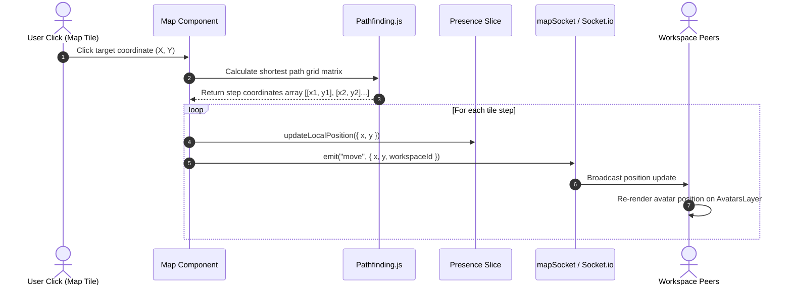
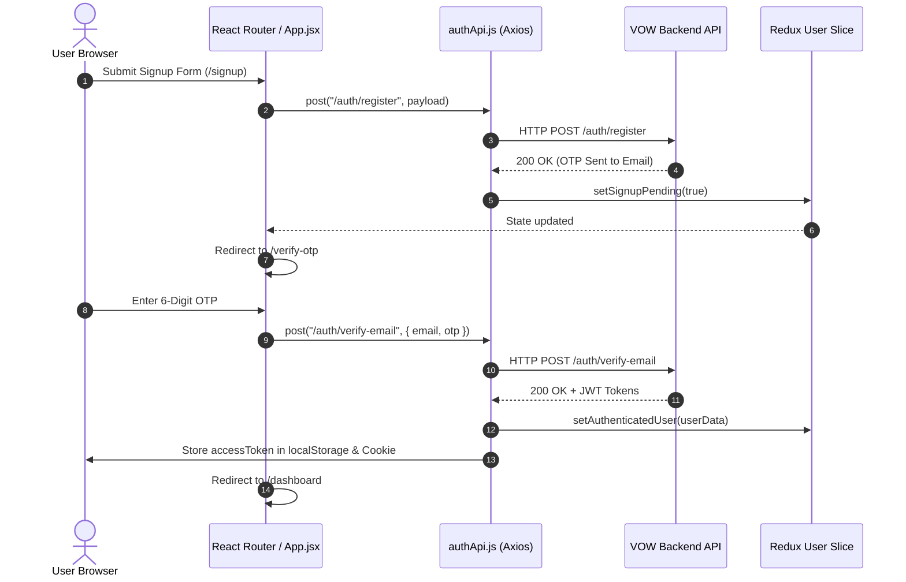

# VOW Frontend - System Architecture Document

## 1. Executive Overview

**VOW (Virtual Organized World) Frontend** is an immersive React 19 single-page application (SPA) designed for distributed remote teams to interact in a 2D virtual office environment. Built on top of modern web technologies—**React 19**, **Vite**, **Redux Toolkit (with Redux Persist)**, **Tailwind CSS 4**, **Socket.io Client**, **WebRTC SFU**, and **Google Gemini AI**—the frontend provides high-performance real-time spatial avatar navigation, persistent chat, low-latency audio/video conferencing, and intelligent AI copilot capabilities.

---

## 2. High-Level System Architecture Topology

```mermaid
graph TD
    subgraph Browser / Client Architecture
        ReactUI["React 19 UI Component Hierarchy"]
        Router["React Router v7 Navigation & Guards"]
        ReduxStore["Redux Toolkit Global Store"]
        PersistEngine["Redux Persist (LocalStorage Engine)"]
        
        subgraph Subsystems
            SpatialGrid["2D Canvas & Pathfinding Engine (Pathfinding.js)"]
            ChatEngine["Socket.io Chat & DM Handler"]
            VideoEngine["SFU WebRTC Video/Audio Controller"]
            GeminiCopilot["Google Gemini AI Client Engine"]
        end
    end

    subgraph External & Backend Services
        BackendREST["Express 5 REST API Gateway (VOW Backend)"]
        PresenceSocket["Socket.io Real-Time Server"]
        SFUServer["SFU WebSockets Signaling Server"]
        S3Bucket["AWS S3 Cloud Blob Storage"]
        GeminiAPI["Google Gemini GenAI Service"]
    end

    ReactUI --> Router
    ReactUI --> ReduxStore
    ReduxStore <--> PersistEngine
    
    ReactUI --> SpatialGrid
    ReactUI --> ChatEngine
    ReactUI --> VideoEngine
    ReactUI --> GeminiCopilot

    ReactUI <-->|Axios / REST| BackendREST
    SpatialGrid <-->|Socket.io WSS| PresenceSocket
    ChatEngine <-->|Socket.io WSS| PresenceSocket
    VideoEngine <-->|WebSockets & WebRTC SFU| SFUServer
    ReactUI <-->|Pre-Signed URLs| S3Bucket
    GeminiCopilot <-->|HTTPS API| GeminiAPI
```

---

## 3. Core Technical Stack

| Domain | Technology / Library | Purpose & Rationale |
| :--- | :--- | :--- |
| **Framework** | React 19 (`react`, `react-dom`) | Modern concurrent UI engine with optimized rendering and hook APIs. |
| **Build Tooling** | Vite (`vite`, `@vitejs/plugin-react`) | Ultra-fast HMR and ESM-based bundle compilation. |
| **Routing** | React Router v7 (`react-router-dom`) | Declarative client-side routing with custom protective flow guards. |
| **State Management** | Redux Toolkit & Redux Persist | Centralized single-source-of-truth state tree with automatic storage persistence. |
| **Styling & Icons** | Tailwind CSS 4 & Lucide React | Utility-first styling framework with high-performance CSS compilation and modern icons. |
| **Real-Time Websockets** | Socket.io Client (`socket.io-client`) | Bi-directional low-latency event transport for spatial movement, chat, and DMs. |
| **Media Conferencing** | Custom SFU WebRTC Client | Selective Forwarding Unit WebRTC signaling for multi-participant video and audio streaming. |
| **Spatial Movement** | Pathfinding.js (`pathfinding`) | A* search grid pathfinding algorithm for smooth 2D avatar navigation. |
| **AI Integration** | `@google/genai` & `@google/generative-ai` | Natural language workspace assistant for conversation summaries and contextual AI chat. |
| **HTTP Client** | Axios (`axios`) | Interceptor-configured REST client supporting Bearer JWT token rotation and credentials. |

---

## 4. Subsystem Breakdown

### 4.1 Routing & Guard Infrastructure (`src/App.jsx`, `src/ProtectedRoute.jsx`, `src/FlowProtectedRoute.jsx`)
- **`ProtectedRoute.jsx`**: Validates user authentication state via `isAuthenticated()` helper. Redirects unauthenticated users to `/login`.
- **`FlowProtectedRoute.jsx`**: Controls multi-step workflows (e.g., OTP Verification `/verify-otp`, Password Reset `/reset-password`, Map Entrance `/map`). Prevents users from skipping mandatory steps.
- **`RouteWatcher.jsx`**: Listens for location changes to reset transient flow flags or manage navigation history.

### 4.2 State Management Architecture (`src/components/store.js`)
The application state is unified under a single Redux store configured with `redux-persist`:
- **`user` (`userslice.js`)**: User identity, token state, OTP flow status, and profile metadata.
- **`workspace` (`workspaceSlice.js`)**: Active workspace metadata, invite codes, role privileges (`manager`, `supervisor`, `member`).
- **`presence` (`presenceSlice.js`)**: Real-time avatar positions `(x, y)`, connected member maps, and spatial user coordinates.
- **`team` (`teamslices.js`)**: Workspace teams, channels, and team member selections.
- **`files` (`filesSlice.js`)**: Workspace uploaded files, uploading progress, and presigned URL cache.

### 4.3 2D Spatial Office & Avatar Layer (`src/components/map/`)
- **`Map.jsx`**: Renders the customizable 2D office floorplan grid. Maps obstacle boundaries and walkable tile matrices.
- **Pathfinding Engine**: Uses `pathfinding` (A* algorithm) to compute path arrays between the avatar's current tile position and the target tile clicked by the user.
- **`AvatarsLayer.jsx`**: Renders active team members' avatars on top of the tile grid with smooth position interpolations.
- **`mapSocket.jsx`**: Handles real-time Socket.io events (`join`, `move`, `leave`, `presence-sync`) to transmit avatar movement to peers.

### 4.4 Real-Time Chat & Direct Messaging (`src/components/chat/`)
- **`ChatLayout.jsx` & `chat.jsx`**: Split view displaying channels, active workspace members, direct messages, and chat history.
- **`socket.jsx`**: Socket connection factory maintaining connection state and channel subscriptions.
- **Features**: Emoji pickers (`emoji-picker-react`), Markdown rendering (`react-markdown`, `remark-gfm`), reaction popups, and real-time read receipts.

### 4.5 WebRTC SFU Video Conferencing (`src/components/chat/useSfuVideoCall.js`, `sfuSignaling.js`)
- **Signaling Layer**: Connects via custom WebSockets (`sfuSignaling.js`) to establish peer SDP offers/answers and ICE candidates.
- **SFU Streaming**: Consumes multi-stream audio/video tracks routed through the backend SFU engine.
- **`VideoConference.jsx`**: Dynamic grid view supporting participant video feeds, screen sharing, mute/unmute toggles, and speaking indicators.

### 4.6 Gemini AI Copilot (`geminichat.jsx`, `geminiservice.js`)
- Directly interacts with Google Gemini Pro API to provide an in-app AI workspace copilot.
- Features real-time context streaming, automated chat summaries, and intelligent workspace query responses.

---

## 5. Sequence Flows

### 5.1 Real-Time Avatar Movement Sequence

### 5.2 Authentication & OTP Verification Flow

