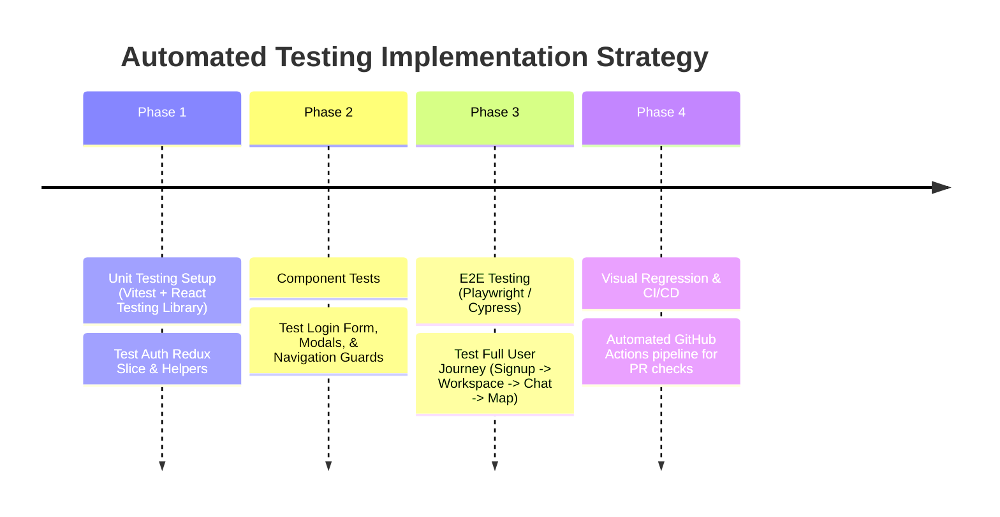

# VOW Frontend - Technical Debt, Architecture & Scalability Improvement Plan

This document outlines architectural recommendations, performance optimization strategies, code quality refactoring tasks, and feature roadmaps for the **VOW Frontend**.

---

## 1. Codebase Refactoring & Technical Debt Cleanup

### 1.1 Move Hardcoded API URLs to Environment Configuration
- **Location**: `src/config.js#L2` (`export const API_URL = "https://vow-org.me/videochat"`)
- **Issue**: Production URLs are hardcoded in source code files alongside commented local code.
- **Fix**: Standardize all API and Socket references using `import.meta.env` keys across all modules:
  ```javascript
  export const API_URL = import.meta.env.VITE_API_URL || "http://localhost:8000/api/v1";
  ```

### 1.2 TypeScript Migration (JSX -> TSX)
- **Current State**: The repository uses JavaScript (`.jsx` and `.js`) with loose prop types and un-typed API responses.
- **Recommendation**:
  - Convert `.jsx` files to `.tsx` incrementally.
  - Define strict interface definitions for User, Workspace, Channel, Message, and Map Object schemas.
  - Implement strict compiler checks via `tsconfig.json`.

### 1.3 Consolidated Token Management
- **Location**: `src/api/authApi.js`, `axiosConfig.js`, `src/App.jsx`
- **Issue**: Authentication tokens are stored in both `localStorage` ("accessToken") and HTTP-Only cookies, creating potential state sync desynchronization.
- **Fix**: Centralize token storage logic inside a single Auth Storage abstraction (`authStorage.js`).

---

## 2. Performance & Scalability Optimizations

### 2.1 2D Rendering Engine Upgrade (Canvas / WebGL Migration)
- **Current State**: `src/components/map/Map.jsx` renders map tiles and objects using DOM HTML elements and inline absolute CSS positioning.
- **Limitation**: Large office maps with 100+ active avatars experience high DOM node counts, leading to browser layout thrashing and lower FPS.
- **Recommendation**:
  Migrate spatial rendering to an HTML5 Canvas or WebGL engine using **PixiJS** or **Phaser.js**.
  - **Benefits**: Hardware-accelerated GPU rendering, smooth 60 FPS avatar interpolations, and scalable sprite layers.

### 2.2 Virtualized Chat Message Lists
- **Current State**: `ChatRoomSection.jsx` renders all channel messages directly into the DOM tree.
- **Limitation**: Channels with thousands of historical messages cause severe DOM memory expansion and scrolling lag.
- **Recommendation**:
  Integrate `@tanstack/react-virtual` or `react-window` to render only the visible message window.

### 2.3 React Component Memoization & Bundle Splitting
- **Current State**: Dynamic imports are partially used across React Router routes.
- **Recommendation**:
  - Wrap high-frequency rendering components (`AvatarsLayer`, `FeatureCard`, `Message`) in `React.memo`.
  - Use `React.lazy` and `Suspense` for heavy route bundles (`Map.jsx`, `ChatApp.jsx`, `VideoConference.jsx`).

---

## 3. Automated Testing Strategy Roadmap

The project currently relies entirely on manual UI verification. Implementing automated testing is a high priority:



### Proposed Tech Stack:
- **Unit & Integration**: Vitest (`vitest`), `@testing-library/react`, `@testing-library/user-event`
- **End-to-End**: Playwright (`@playwright/test`)

---

## 4. Accessibility (a11y) & UX Enhancements

1. **Keyboard Spatial Controls**: Allow users to move avatars using `W A S D` or Arrow keys as an alternative to tile clicking.
2. **Screen Reader ARIA Attributes**: Add proper `aria-label`, `role="dialog"`, and `aria-expanded` attributes to modals and chat popups.
3. **Responsive Mobile Layout**: Enhance mobile viewport responsiveness for spatial map views and WebRTC conferencing grids.
